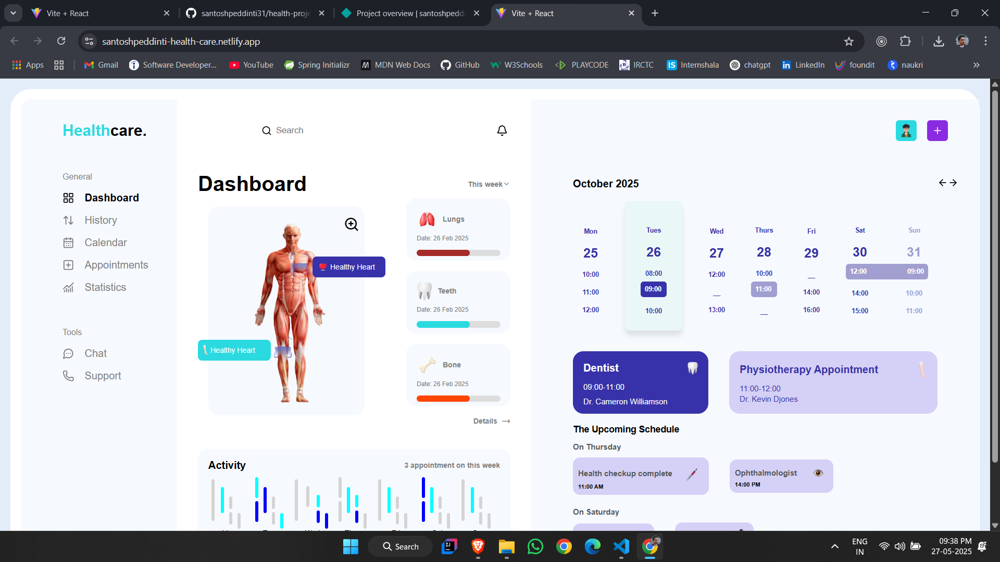

# React + Vite

This template provides a minimal setup to get React working in Vite with HMR and some ESLint rules.

# Healthcare. Project

Note: This design is currently optimized only for laptop (desktop) view. Due to time constraints and other pending tasks, I was unable to implement responsive design. However, I’m more than willing to make it responsive if required.

I kindly request your understanding regarding the current situation. I'm looking forward to your feedback. If there are any changes or additional requirements, please feel free to reach out — I’ll be happy to update accordingly.

## Final output:

